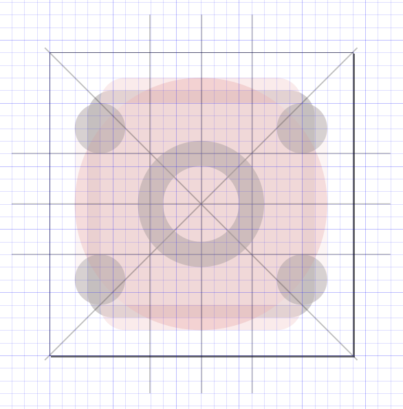

# Material Design SVG Icon Toolset

This repository contains a bunch of different things that I made to be able to contribute to the
[Material Design Icon Project](https://materialdesignicons.com/).

My Workflow is basically this:

1. I create all my icons in separate layers on top of my template in Inkscape
2. When happy I export the icons to separate files using my script
3. I edit the exported in Inkscape again to convert everything into a single path, then run svgcleaner on it

You'll find everything from these steps in this repository

## 1. Inkscape Material Design Icon Template

The [template](material-template.svg) allows to easily follow the
[Google Design Guidelines](https://www.google.de/design/spec/style/icons.html#icons-system-icons)
for Material Design Icons. The SVG file is meant to be used with Inkscape. It contains two layers with Keylineshapes
and Geometry as specified by Google. A grid allows you to follow the pixel recommendations easily.

## 2. Export all layers from an Inkscape SVG

The [exportlayers.py] script is a simple Python script that exports all layers as single SVG files
from a given Inkscape file.

Use it like this:

    ./exportlayers.py material-icons.svg material-icons

## 3. My Icons

All the icons I made can be found in the `material-icons` directory and hopefully soon in the
MaterialIconsProject